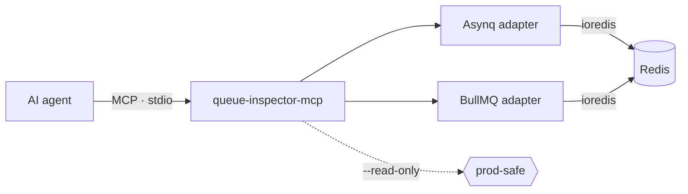

A queue backs up at 2am. The retry count is climbing and something downstream is timing out. The questions in your head are all about jobs: how many tasks are stuck in retry, what error the top one failed with, how many attempts it has left, whether the dead ones can be requeued safely.

So you point an agent at Redis through an MCP server and ask. It hands you back keys.

That is the gap I kept hitting. A general-purpose Redis MCP server sees strings, hashes, and sorted sets. It does not know that an Asynq task is a protobuf blob living in the `msg` field of a hash, or that a BullMQ job's state is decided entirely by which sorted set holds its id. The agent can read the raw bytes. It cannot answer the question you actually asked.

[`queue-inspector-mcp`](https://github.com/Yusufihsangorgel/queue-inspector-mcp) encodes the knowledge that closes that gap. It speaks to two backends today — [Asynq](https://github.com/hibiken/asynq) (Go) and [BullMQ](https://github.com/taskforcesh/bullmq) (Node), both Redis-backed — and exposes six tools over MCP stdio: `list_queues`, `queue_stats`, `list_jobs`, `get_job`, `retry_job`, and `delete_job`. It runs with `npx queue-inspector-mcp` and a `REDIS_URL`. The rest of this post is about the three decisions that shaped it, and where it stops.

## What a state-aware server changes

The unit of debugging changes. Instead of "there are 412 keys under `asynq:{default}:`," `queue_stats` reports 380 pending, 4 active, 27 retry, 1 archived — the counts a human on-call would ask for first. `list_jobs` pages through one state and returns each job's id, type, attempt count, and a truncated last error. `get_job` gives you the full payload, the retry ceiling, the last failure message, and the timestamps.

The point is not that a person couldn't dig this out of raw Redis. It's that an agent doing incident triage should reason about the queue in the same terms its owner does, so its next suggested action ("this dead job is a transient timeout, requeue it") lands in the right vocabulary instead of in Redis internals.

That framing forced three decisions I want to be honest about, because two of them are deliberately less convenient than the obvious alternative.

## Decision 1: each backend keeps its own state names

The tempting move is to invent a unified vocabulary — pick five nice words like `queued / running / retrying / dead / done`, and map both libraries onto them. It reads well in a README and it is wrong the moment you rely on it.

Asynq and BullMQ model job lifecycles differently, and the differences matter during an incident. Asynq has a `scheduled` state and a separate `retry` state, and its terminal "dead" state is called `archived`. BullMQ has `delayed`, `prioritized`, `waiting-children` (for flows), and `paused`, and its terminal failure state is `failed`. A `waiting-children` job is blocked on a flow; there is no honest Asynq word for that. Flattening these into a shared five-word vocabulary throws away exactly the distinction you need to act correctly.

So the server does not invent a shared vocabulary. `queue_stats` reports each backend's own state names, and each state maps to a specific Redis structure — Asynq's `archived` is a sorted set, BullMQ's `waiting` is a list. If you are staring at an Asynq queue, you see `archived`, because that is the word in the Asynq docs, the Asynq dashboard, and your coworker's runbook. The tool refuses to paper over a real difference to look tidier.

## Decision 2: retry and delete run the library's own script, not mine

`retry_job` and `delete_job` mutate a production database. This is the part I was least willing to improvise on.

The naive implementation of "requeue a dead job" is a couple of Redis commands: pull the id out of the archived set, push it onto pending, flip a state field. It works in the demo. It also races with a running worker, skips the bookkeeping the library does around retry counters and group aggregation, and drifts the moment either library changes its internals.

Instead, the mutating tools run each library's own atomic Lua. Retry executes Asynq's `Inspector.RunTask` script and BullMQ's `Job.retry` (`reprocessJob`) script; delete executes Asynq's `Inspector.DeleteTask` and BullMQ's `Job.remove` (`removeJob`) script. These are vendored verbatim from the libraries — pinned to specific versions — and registered on the Redis client so the mutation is exactly the one the library would have performed.

The upside is that the semantics match the library, including the sharp edges. Retrying a BullMQ job applies only to `failed` or `completed` jobs and does not reset `attemptsMade`, because that is what `Job.retry()` does. Neither backend will retry or delete an `active` job — a job a worker is holding is refused, not force-moved. `delete_job` removes a single BullMQ job and does not cascade into a flow's children. I did not design those rules; I inherited them on purpose, so the tool never does something to your queue that the library itself would not do.

## Decision 3: read-only is the production posture

`retry_job` and `delete_job` are useful, and I do not want an agent calling either one against a live queue by accident.

With `--read-only` (or `QUEUE_INSPECTOR_READ_ONLY=1`) the server never registers the two mutating tools. They are absent from `tools/list` entirely — not gated behind a confirmation prompt the model can talk itself past, just not present. The agent cannot call a tool it cannot see.

This is the configuration I recommend for pointing an agent at a production database: inspection is safe and always on, mutation is an explicit, separate decision you make by leaving the flag off. Read is the default; write is the exception you opt into.

## What it doesn't do

A launch post that only lists strengths is hiding something, so here is where it stops.

- **Two backends, not many.** Only Asynq and BullMQ are supported. Sidekiq, Celery, and RQ are not. The whole value here is library-specific knowledge, so each backend is real work, not a config entry.
- **No dashboard.** This is an MCP server for programmatic use. If you want a web UI for your queues, Asynq and BullMQ both already have good ones — use those.
- **No streaming or watch.** Every tool call is a point-in-time read. There is no subscription to queue events, so an agent polls rather than watches.
- **Some Asynq depth is not surfaced yet.** Group aggregation (the `aggregating` state) is not exposed in this release.

None of these are secret; they are all in the README, next to the features. A dependency that oversells itself is worse than one that tells you exactly where its edges are, and a queue tool is the last place you want a pleasant surprise.

## Where this is useful

If your stack runs Asynq or BullMQ and you already let an agent help with operational work, this gives it the vocabulary to reason about a misbehaving queue in the terms the queue actually uses — and, in read-only mode, to do that against production without being able to change anything.

The code is on [GitHub](https://github.com/Yusufihsangorgel/queue-inspector-mcp) and [npm](https://www.npmjs.com/package/queue-inspector-mcp), MIT licensed. If you want the build mechanics instead of the reasoning — how the Asynq protobuf gets decoded off the wire, why BullMQ's state has to be inferred from set membership, and how the tests run real Go and Node producers against a real Redis — I wrote that up separately.
